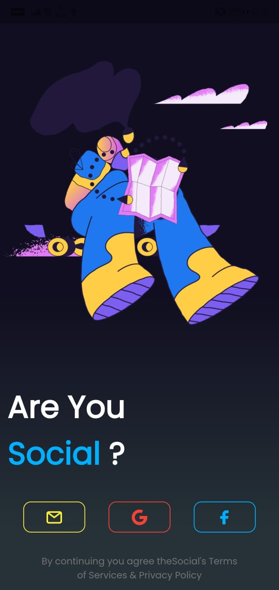
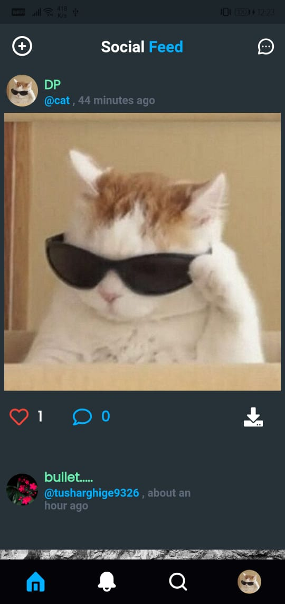
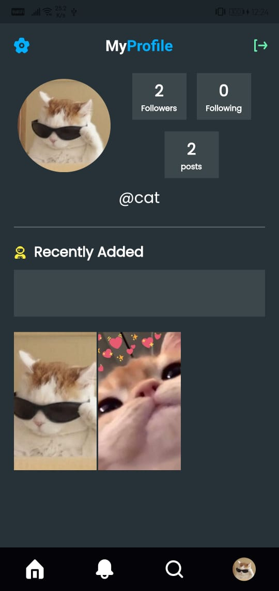

<h3>Social Media Application - Fluttter</h3>

Flutter + Firebase Social Media App 

- <h4>Application<h4>

    <table>
        <tr>
            <td style="text-align: center">
                
            </td>
            <td style="text-align: center">
                
            </td>
            <td style="text-align: center">
                
            </td>
            <td style="text-align: center">
                
            </td>
            <td style="text-align: center">
                
            </td>
        </tr>
    </table>

- <h4>Features<h4>
1. Login
2. Signup (with GoogleSignIn)
3. Profile Generation
4. Upload Posts
5. Search New Users
6. Follow/Unfollow Users
7. Like Posts
8. In App Notifications

- <h4>More Features To Come<h4>
1. Direct Chat
2. Group Chat
3. Cloud Messaging FCM
4. Comments Section
5. Post Upload Location 